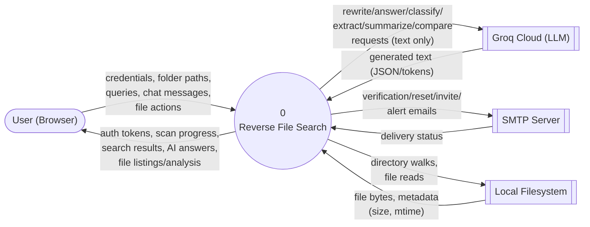
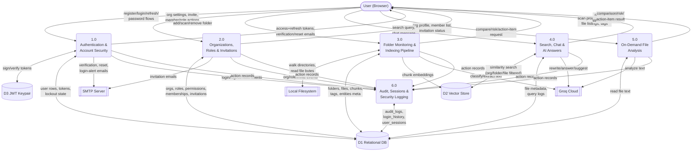
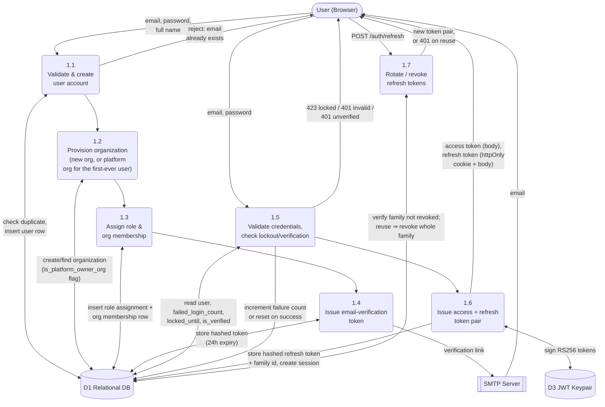
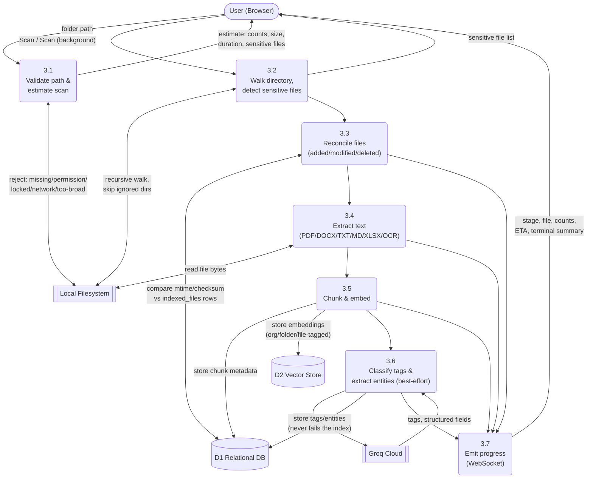
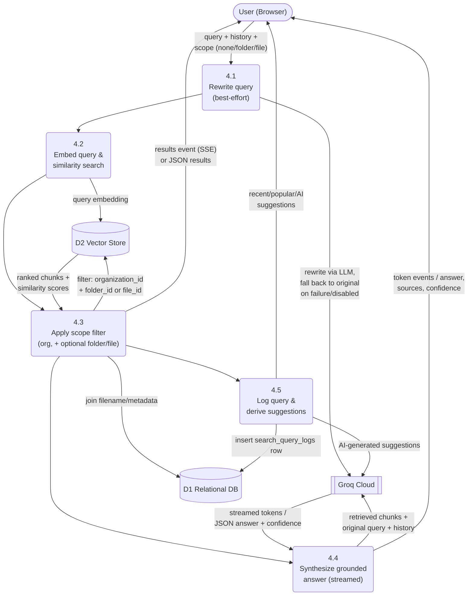
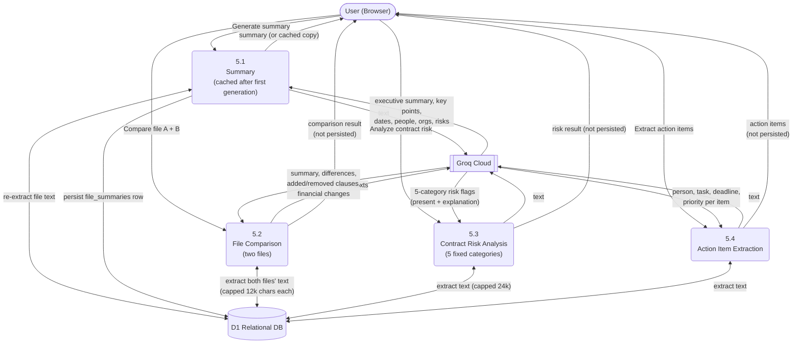
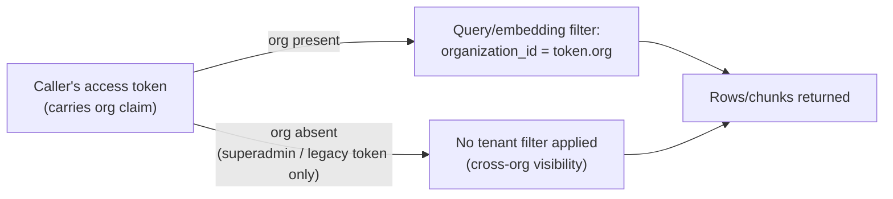

# Data Flow Diagrams (DFD)

## Reverse File Search

**Version:** 1.0
**Date:** 2026-07-30
**Companion to:** [`SRS.md`](SRS.md) (requirements), [`ARCHITECTURE.md`](ARCHITECTURE.md) (service map), [`USER_GUIDE.md`](USER_GUIDE.md) (user-facing walkthrough)

This document describes how data moves through Reverse File Search, from external entities (the browser user, third-party services) through the backend's processes into its data stores and back out again. Diagrams use the Yourdon/DeMarco convention (external entity = box, process = rounded box, data store = open-ended bar, flow = labeled arrow), rendered as Mermaid flowcharts.

---

## 0. External Entities & Data Stores (used throughout)

| External Entity | Role |
|---|---|
| **User (Browser)** | An authenticated (or, for a handful of flows, anonymous/pre-auth) person interacting with the React SPA |
| **Groq Cloud** | Third-party LLM API — query rewriting, AI answers, tagging, entity extraction, summaries, suggestions, file comparison, contract risk analysis, action-item extraction |
| **SMTP Server** | Third-party mail relay (Gmail SMTP in current config) — verification, password-reset, invitation, and security-notification emails |
| **Local Filesystem** | The disk the backend process can read — monitored folders and the files inside them |

| Data Store | Contents |
|---|---|
| **D1 — Relational DB (PostgreSQL)** | All structured metadata: users, organizations, roles/permissions, sessions/tokens, folders, files, chunks metadata, tags, entities, summaries, search logs, audit/login history (19 tables total — see §5 of the SRS) |
| **D2 — Vector Store (Chroma)** | Chunk embeddings, keyed by `chroma_id`, filterable by `organization_id` / `folder_id` / `file_id` metadata |
| **D3 — JWT Keypair (disk)** | RS256 private/public key files used to sign and verify access/refresh tokens |

---

## 1. Context Diagram (Level 0)

The whole system as a single process, showing every external entity it exchanges data with.

---

## 2. Level 1 — Major Subsystems

Six cooperating process groups inside the backend, and how data flows between them and the two internal data stores.

---

## 3. Level 2 — Registration & Authentication (Process 1.0)

Detail of what happens inside "Authentication & Account Security" for the two highest-traffic flows: self-registration and login.

**Key business rules embedded in this flow:**
- The very first user ever registered on the system becomes **Super Admin** and owns a brand-new **platform-owner organization**.
- Every subsequent self-registered user gets **their own new, separate organization** (Organization Admin/Owner of it) — folders and files never cross this boundary.
- 5 consecutive bad passwords → account locked 15 minutes (423).
- A reused (already-rotated) refresh token revokes its entire token family and session — a session-hijack containment measure.

---

## 4. Level 2 — Folder Scan & Indexing Pipeline (Process 3.0)

**Key business rules embedded in this flow:**
- Only files with a supported extension are extracted/embedded; everything else is counted but skipped.
- Sensitive-looking files (`.env`, `.pem`, `id_rsa`, etc.) are excluded from extraction/embedding by default; the user can override per-scan.
- A checksum match on a changed-mtime file updates only the timestamp — no re-extraction.
- Tag/entity generation failures never flip a successfully-indexed file to `failed`.
- All rows and embeddings created here are stamped with the acting user's `organization_id`.

---

## 5. Level 2 — Search & Chat Retrieval (Process 4.0)

**Key business rules embedded in this flow:**
- File-scoped retrieval bypasses similarity search entirely — it returns that file's full chunk set in document order.
- Retrieval is always filtered by the caller's `organization_id` (the one documented exception: a superadmin/legacy token with no `org` claim applies no tenant filter).
- The AI is shown only the retrieved chunk text; if that's insufficient, the fixed string `"I couldn't find enough information."` is returned instead of a guess.
- Conversation `history` is never embedded for retrieval — only the current turn's (rewritten) query is.

---

## 6. Level 2 — On-Demand File Analysis (Process 5.0)

Covers document summaries, file comparison, contract risk analysis, and action-item extraction — all stateless-per-request except summaries, which are cached.

**Key business rules embedded in this flow:**
- All four analyses require `FILE_READ` permission and are org-scoped (the file must belong to the caller's organization).
- Comparison/risk/action-items are recomputed on every request (no caching); only the on-demand summary is persisted (`file_summaries`) and reused until explicitly regenerated.
- A misconfigured or unreachable LLM provider yields a specific `503` for all four — never a silent guess.
- Contract risk analysis always returns exactly 5 categories (Missing Signature, Unlimited Liability, Auto-Renewal, Late Fees, Termination Clause); any category the model omits is backfilled as `present=false`.

---

## 7. Data Isolation Summary (cross-cutting)

Every process above that touches `D1`/`D2` for folder/file/search data applies the same tenant boundary:

This is the one intentional gap in per-organization isolation, and it is documented as such in [`SRS.md` §6.1](SRS.md#61-security).

